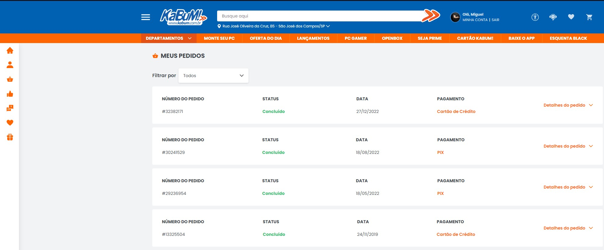
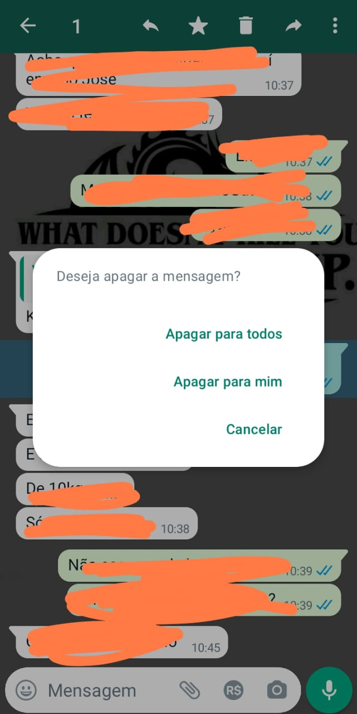
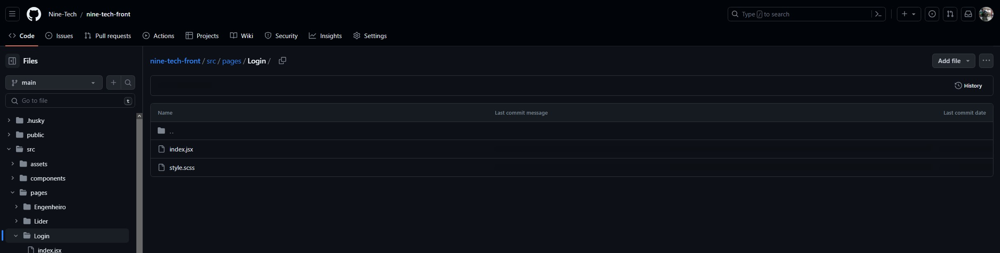
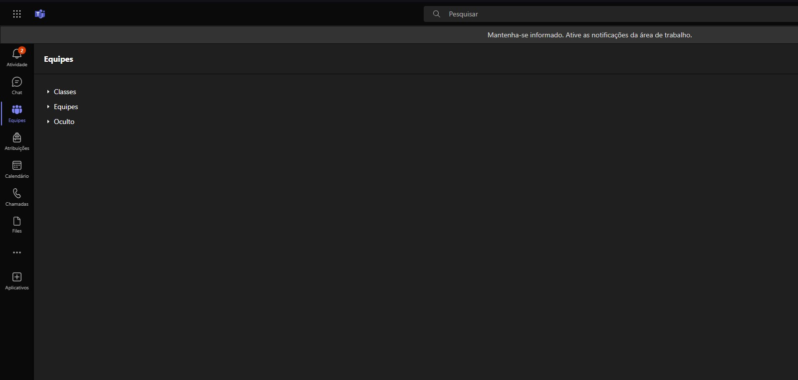
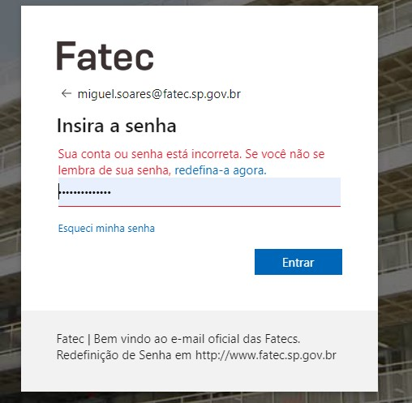
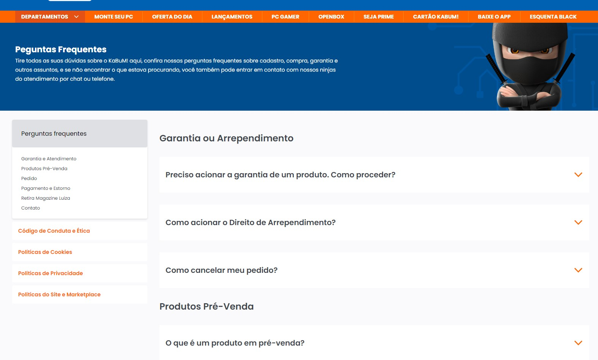

# Repositório de Interação Humano-Computador - Giuliano Bertoti

## IHC Atual: Avaliação das Heurísticas de Usabilidade e Acessibilidade

Neste trabalho será avaliado diverças formas de Interação Humano-Computador. 

---

## 9 Pontos Positivos Encontrados

### Lei da Heurística Nº 1: Visibilidade do status do sistema

1. **Kabum**

   
   
   O sistema mantém os usuários informados sobre as ações em andamento por meio de feedback apropriado, garantindo uma resposta dentro de um prazo razoável.

### Lei da Heurística Nº 2: Correspondência entre o sistema e o mundo real

2. **Spotify**

   
   O sistema utiliza linguagem familiar aos usuários, seguindo convenções do mundo real e apresentando informações de maneira lógica, de acordo com o modelo mental do usuário.

### Lei da Heurística Nº 3: Controle de usuários e liberdade

3. **WhatsApp**

   
   
   Os usuários têm controle sobre as funções do sistema, com uma "saída de emergência" claramente marcada para abandonar estados indesejados.

### Lei da Heurística Nº 5: Prevenção de erros

4. **Google**

   
   
   O design cuidadoso previne problemas antes que ocorram, eliminando condições propensas a erros ou solicitando confirmação antes de ações comprometedoras.

### Lei da Heurística Nº 6: Reconhecimento ao invés de lembrar

5. **GitHub**

   
   
   Minimiza a carga de memória do usuário, tornando objetos, ações e opções visíveis, sem a necessidade de lembrar informações entre partes do diálogo.

### Lei da Heurística Nº 7: Flexibilidade e eficiência de uso

6. **Opera**

   
   
   Oferece atalhos para usuários experientes, permitindo a execução rápida de operações e personalização de ações frequentes.

### Lei da Heurística Nº 8: Design estético e minimalista

7. **Teams**

   
   
   Diálogos são livres de informações irrelevantes, priorizando a visibilidade de unidades de informação relevantes.

### Lei da Heurística Nº 9: Ajudar os usuários a reconhecer, diagnosticar e recuperar erros

8. **Uol Mail**

   
   
   Mensagens de erro são expressas de maneira simples, indicam precisamente o problema e sugerem soluções construtivas, evitando culpas ou intimidações.

### Lei da Heurística Nº 10: Ajuda e documentação

9. **Kabum**

   
   
   Embora seja ideal o uso sem documentação, fornece ajuda fácil de pesquisar, focada na tarefa do usuário e apresentando etapas concretas.

---

## 1 Ponto Negativo Encontrado

### Lei da Heurística Nº 10: Ajuda e documentação

1. **Instagram**

   

   Comandos ou ações similares não têm efeitos consistentes, desviando das convenções da plataforma e gerando confusão nos usuários.
